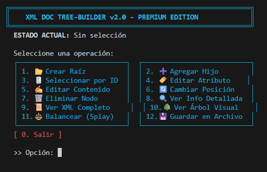

# XMLDocument TreeBuilder

[](https://github.com/Geovanni-Gonzalez/XMLDocument-TreeBuilder/actions/workflows/ci.yml)

## Descripción
Proyecto C++ para representar documentos XML como árbol de nodos usando listas enlazadas y utilidades propias.

## Objetivo
Practicar estructuras dinámicas, árboles y documentos jerarquicos.

## Tecnologías utilizadas
- C++
- Árboles
- Listas enlazadas
- POO

## Funcionalidades principales
- XMLDocument
- XMLNode
- LinkedList propia
- StringLib auxiliar
- main.cpp demo

## Mi rol
Implementé estructuras principales para construir y manipular XML en memoria.

## Aprendizajes clave
- Jerarquias
- Listas enlazadas
- Composicion de clases
- Memoria dinámica

## Instalación y ejecución
```bash
cd XMLDocument-TreeBuilder
g++ main.cpp -o xml_builder.exe
./xml_builder.exe
```

## Estructura del proyecto
- XMLDocument.hpp/XMLNode.hpp: modelo
- LinkedList.hpp: lista
- StringLib.hpp/utils.h: apoyo
- main.cpp: demo

## Capturas o demo


## Estado del proyecto
Proyecto académico funcional.

## Valor técnico demostrado
Demuestra estructuras de datos en C++ y representación jerarquica sin librerías externas.

## Mejoras futuras
- Agregar parser XML
- Serializar a XML
- Pruebas unitarias

## Autor
Geovanni González  
Estudiante de Ingeniería en Computación  
GitHub: [Geovanni-Gonzalez](https://github.com/Geovanni-Gonzalez)


